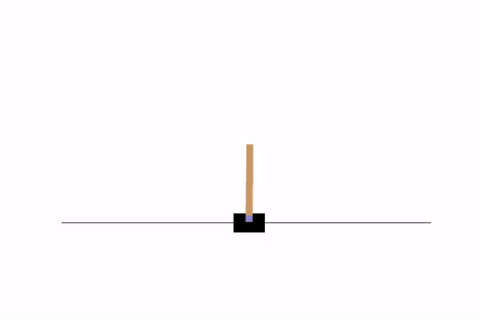

# RL Optimizer Comparison
Empirical comparison of Adaptive Gradient Methods for deep Q learning in the cart-pole environment.

This research project is authored by [Steven Laverty](mailto:lavers@rpi.edu), [Muhammad Khan](mailto:khanm7@rpi.edu) and [Adrian Gillerman](gillea2@rpi.edu). See our paper in `resources/ML_Opt_Project.pdf`. Our results from training using `config/perf-results.json` are available in `checkpoints.zip`.

Adam | AdamW
:--: | :--:
  |  

## Features
Our code supports highly configurable parallelized training for Deep Q learning in the [Gymnasium](https://gymnasium.farama.org/) cart-pole environment.

Four different optimization algorithms are supported:
- RMSProp
- Adam
- AdamW
- RAdam

Data-parsing and visualization utilities are also included.

## Installation

All Python dependencies are specified in `environment-cpu.yml`. If you have `anaconda` or `miniconda` installed, you can simply run:
```
conda create --file=environment-cpu.yml
```

### Using a GPU

To enable GPU training, you must also install PyTorch with CUDA (follow installation instructions at [Pytorch.org](https://pytorch.org/get-started/previous-versions/#v120)). If you have `anaconda` or `miniconda` installed, run:
```
conda install pytorch-cuda=11.8 -c pytorch -c nvidia
```

## Usage

All scripts should be run in the root directory of the repository.

### Configuration
To specify training hyperparameters, we use an extensible JSON format:
```
{
"name": [unique human-readable configuration name],
"checkpoint_dir": [where to store checkpoints],
"hidden_layers": [number of hidden layers in deep Q networks],
"hidden_dim": [number of nodes in each hidden layer of the deep Q networks],
"num_models": [how many random initial models to train],
"q_lr": [the deep Q learning rate (alpha parameter)],
"q_gamma": [the deep Q discount factor (gamma)],
"q_epsilon_max": [the maximum (initial) epsilon for epsilon-greedy policy],
"q_epsilon_min": [the minimum (final) epsilon for epsilon-greedy policy],
"q_epsilon_decay": [the decay factor for epsilon],
"q_replay_buf_len": [how many transitions to store in the experience replay buffer],
"q_target_update_tau": [coefficient for target network soft-parameter update],
"train_steps": [number of action steps between each training iteration],
"batch_size": [minibatch size to sample from the experience replay buffer during training],
"num_eval": [how many full cart-pole simulations to run when evaluating the policy network],
"checkpoint_steps": [number of action steps between each checkpoint],
"optimizers": [list of optim_config objects specifying optimizer hyperparameters for comparison]
}

optim_config [optimizer hyperarameters]
{
"name": [human-readable optimizer name],
"optim_type": [one of "rms_prop", "adam", "adam_w" or "r_adam"]
"lr": [the learning rate]
"eps": [the epsilon value (for numerical stability)]
"weight_decay": [the L2 weight normalization penalty for all weights except output bias]
"rms_alpha": [RMSProp only; the RMSProp alpha term]
"rms_momentum": [RMSProp only; the RMSProp momentum term]
"rms_centered": [RMSProp only; if true, use centered RMSProp]
"adam_betas": [Adam/variants only; 2-array of Adam beta terms]
"adam_amsgrad": [Adam/variants only; if true, use Adam amsgrad variant]
}
```

### Training

Use the `train.py` script:
```
usage: train.py [-h] [-s N] [-p] [-r] config_file [num_iterations]

positional arguments:
  config_file           Configuration JSON file used for training.
  num_iterations        Number of training iterations (1 by default).

options:
  -h, --help            show this help message and exit
  -s N, --start-iteration N
                        Iteration number to resume training from (N=0 by default). To resume training automatically from the latest checkpoint, use N=-1.
  -p, --parallel        Run deep Q learning algorithms in parallel (multiprocessing) rather than in series. Requires more RAM.
  -r, --remove-checkpoints
                        Remove old checkpoints as newer checkpoints are saved.
```

### Plotting results

Use the `visualize.py` script:
```
usage: visualize.py [-h] [-s] [-r RANKS [RANKS ...]] config_file [checkpoint_iteration]

positional arguments:
  config_file           Configuration JSON file used for training.
  checkpoint_iteration  Checkpoint iteration to visualize (-1 by default). To load the latest checkpoint, use None=-1.    

options:
  -h, --help            show this help message and exit
  -s, --smoothing       Use data-smoothing in the plot.
  -r RANKS [RANKS ...], --ranks RANKS [RANKS ...]
                        Choose a specific subset of optimizers to plot.
```

### Visualizing cart-pole performance

Use the `sim.py` script (note: saving output requires `ffmpeg`):
```
usage: sim.py [-h] [-b] [-e EPSILON] [-n NUM_STEPS] [-o OUT_FILE] config_file checkpoint_file

positional arguments:
  config_file           Configuration JSON file used for training.
  checkpoint_file       Checkpoint file used for policy.

options:
  -h, --help            show this help message and exit
  -b, --best            If provided, use the best model from the provided checkpoint, rather than the most recent model.  
  -e EPSILON, --epsilon EPSILON
                        If provided, use an epsilon-greedy policy with this epsilon
  -n NUM_STEPS, --num-steps NUM_STEPS
                        If provided, run the simulation for exactly this many steps. Reset if necessary.
  -o OUT_FILE, --out-file OUT_FILE
                        Output file to store animation.
```
